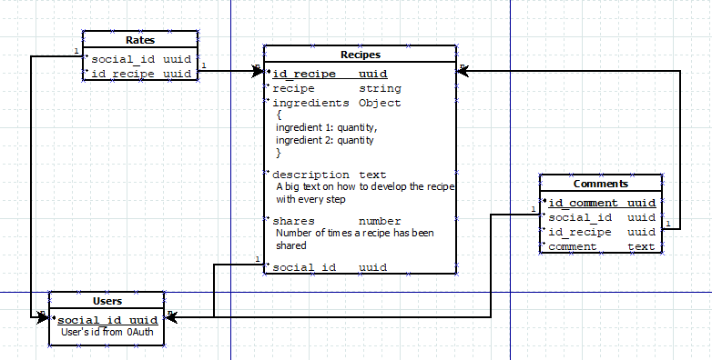

# Database Structure DIA
Database created using MongoDB and controlled from the server-side with mongoose. 

It's been created with [DIA](http://dia-installer.de/index.html.es).

## Collections
___

### Recipes
*Pending to fill...*

### Users
*Pending to fill...*

### Comments
*Pending to fill...*

### Rates
*Pending to fill...*